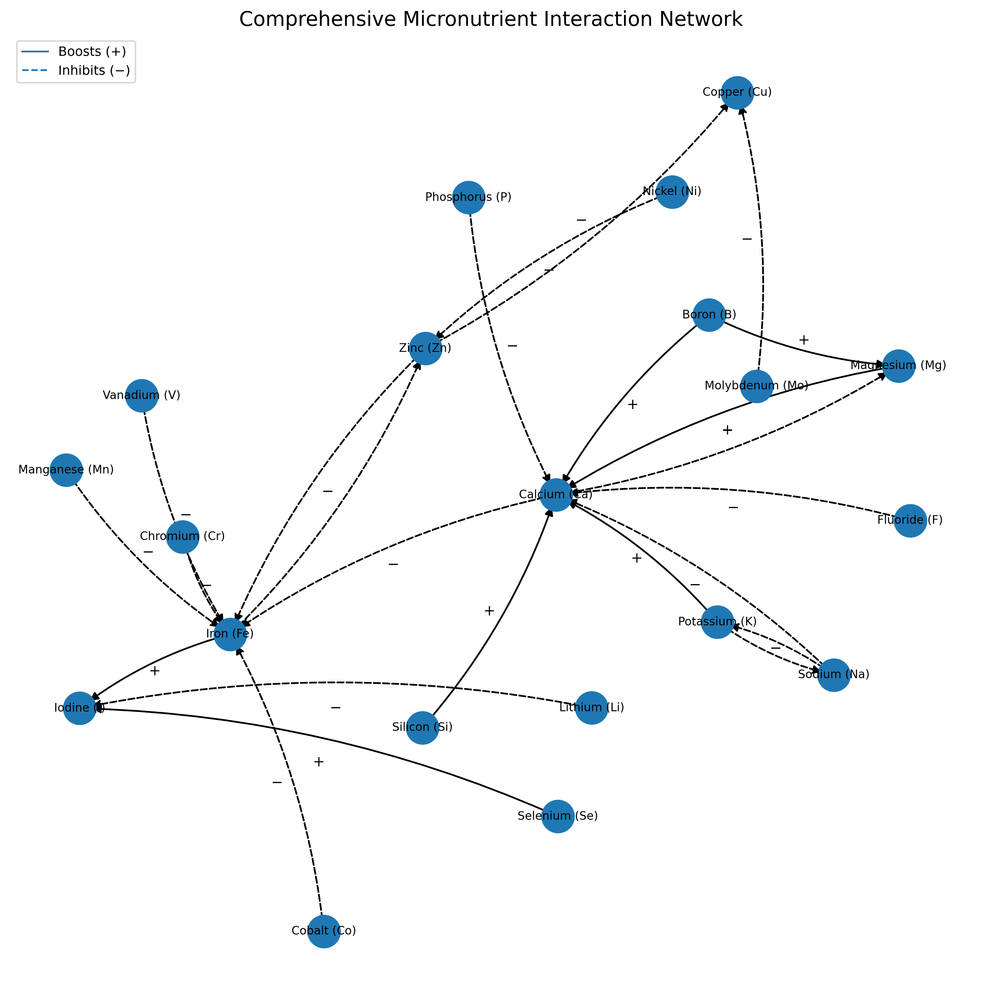
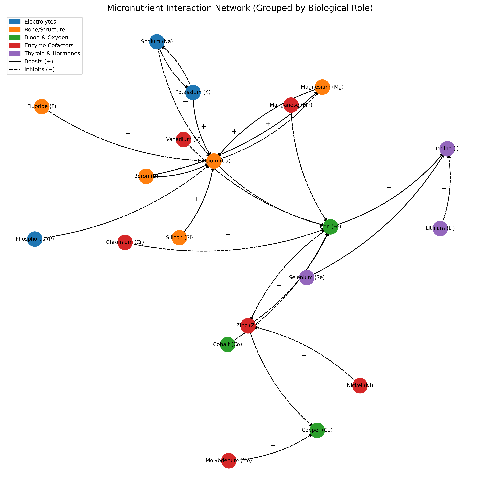
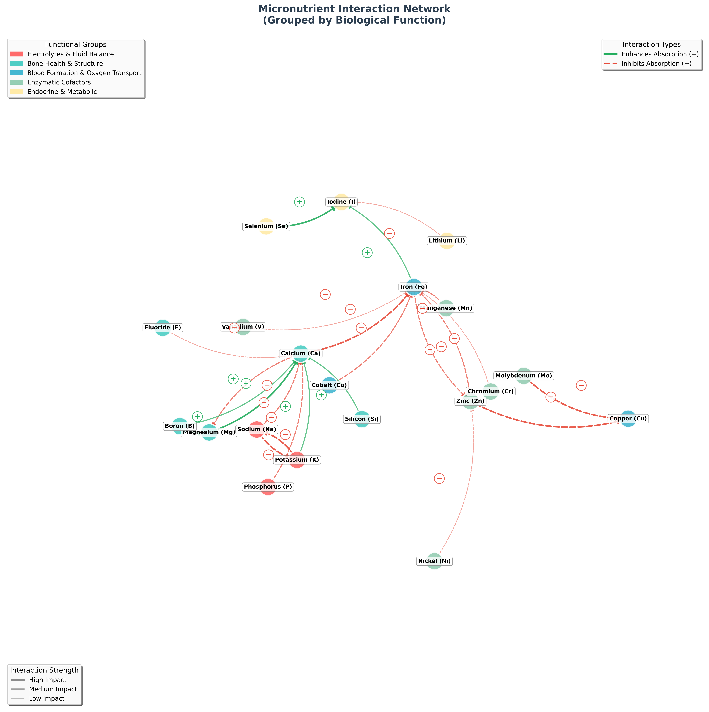

# Micronutrient-Interaction Network

These scripts create my most sophisticated visualization of micronutrient interactions,
sources and relationships were thoroughly researched and curated from scientific literature available to me.

## Features

* **Solid arrows (+)** synergistic interactions  
* **Dashed arrows (−)** antagonistic interactions  
* Arrow labels placed mid-edge for quick scanning  
* Force-directed layout clusters tightly interacting ions  
* Minimal dependencies: `networkx`, `matplotlib`, `numpy`

## Quick start

```bash
git clone https://github.com/soulwax/metal-ion-bioavailability-matplot.git micronutrient-network
cd micronutrient-network
python3 -m venv venv
source venv/bin/activate # On Unix/macOS
venv\Scripts\activate # On Windows
pip install -r requirements.txt
python interaction_network_coloured.py # For more nutrients use instead
python interaction_network_elements.py
```

## Script Arguments

```bash
python interaction_network_elements_pretty.py # you can replace with any of the scripts
```

This will save the output in the `images` directory.

Matplotlib's `savefig` function supports formats like PNG, SVG, PDF, and more.
Details: 

<https://matplotlib.org/stable/api/_as_gen/matplotlib.pyplot.savefig.html>

## Example Output



### Coloured Output with Labels



### Even prettier Output



## License

GPL-3.0

## Acknowledgements

<https://pubmed.ncbi.nlm.nih.gov/>
