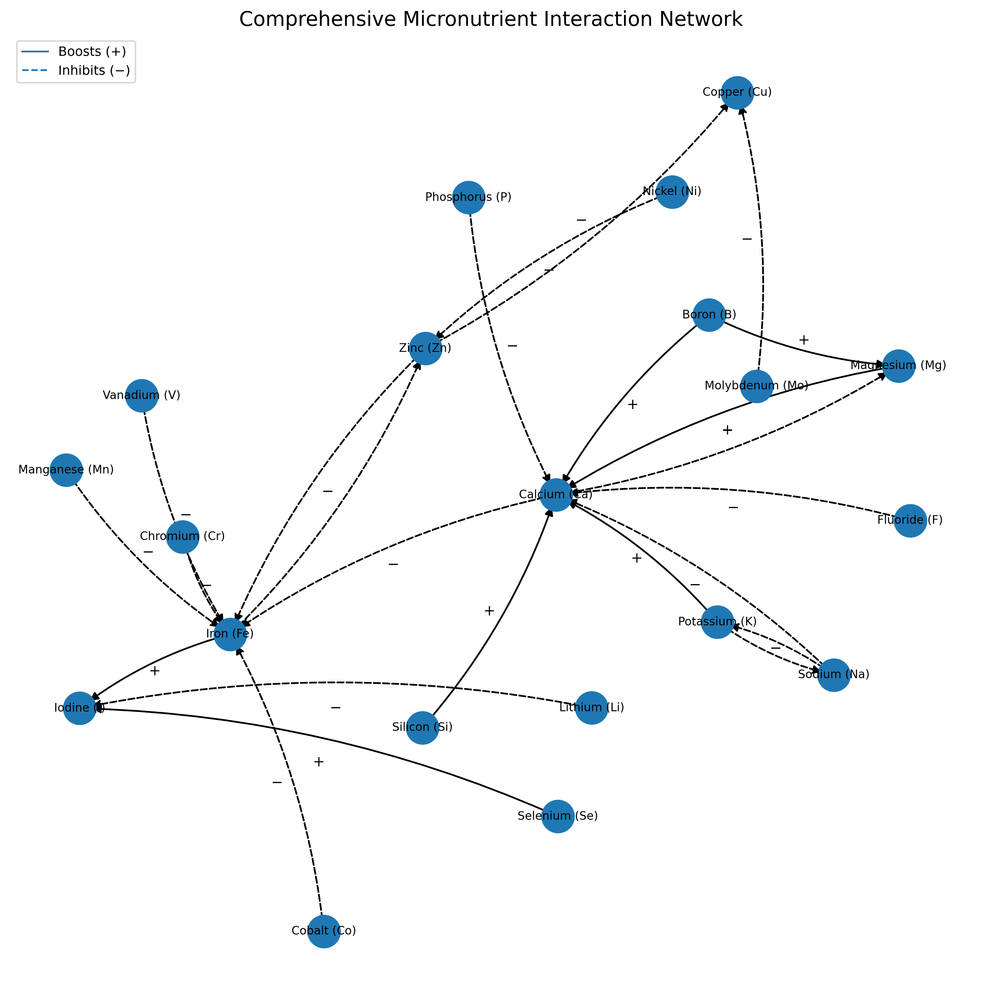
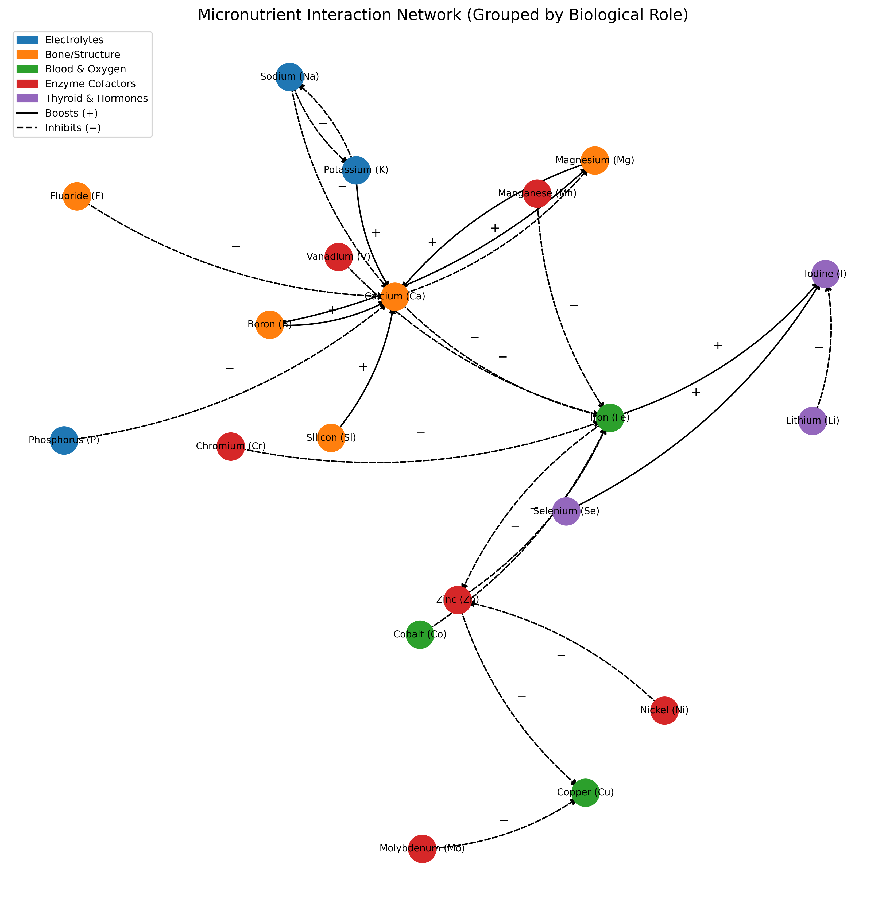

# Micronutrient-Interaction Network

Visualizes how selected dietary minerals, trace elements, and electrolytes **boost** or **inhibit** one another’s bioavailability.  
The spring-layout graph makes relationship hubs (e.g., calcium and iron) easy to spot, while curved arrows keep the diagram readable even with 20+ nutrients.

## Features

* **Solid arrows (+)** synergistic interactions  
* **Dashed arrows (−)** antagonistic interactions  
* Arrow labels placed mid-edge for quick scanning  
* Force-directed layout clusters tightly interacting ions  
* Minimal dependencies: `networkx`, `matplotlib`, `numpy`

## Quick start

```bash
git clone https://github.com/soulwax/metal-ion-bioavailability-matplot.git micronutrient-network
cd micronutrient-network
python3 -m venv venv
source venv/bin/activate # On Unix/macOS
venv\Scripts\activate # On Windows
pip install -r requirements.txt
python interaction_network_coloured.py # For more nutrients use instead
python interaction_network_elements.py
```

## Script Arguments

```bash
python interaction_network_coloured.py --save network.png --dpi 600
# save to file without previewing
python interaction_network_coloured.py --save network.png --dpi 600 --no-legend
python interaction_network_elements.py --save network.png --dpi 600
python interaction_network_elements.py --save network.svg --dpi 600
python interaction_network_elements.py --save network.pdf --dpi 600
python interaction_network_elements.py --save network.pdf --dpi 600 --no-legend
python interaction_network_elements.py --save network.pdf --dpi 600 --no-legend --no-labels
python interaction_network_elements.py --save network.pdf --dpi 600 --no-legend --no-labels --no-edges

# etc. see documentation of matplotlib.pyplot.savefig at 
```

Matplotlib's `savefig` function supports formats like PNG, SVG, PDF, and more.
Details: 

<https://matplotlib.org/stable/api/_as_gen/matplotlib.pyplot.savefig.html>

## Example Output



### Coloured Output



## License

GPL-3.0

## Acknowledgements

<https://pubmed.ncbi.nlm.nih.gov/>
